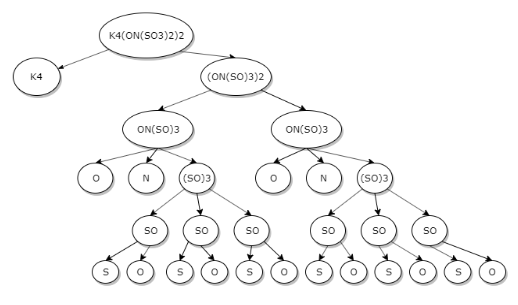
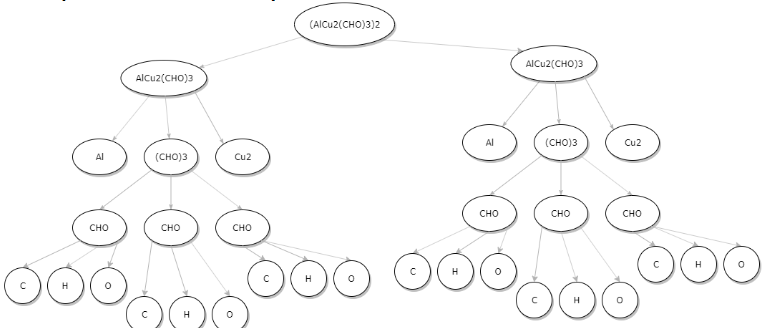
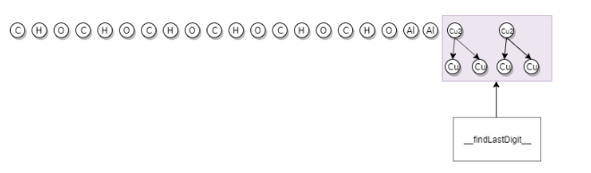

# Molecular-Parser
The main task of this script is to create a parser that counts the number of atoms present within a formula.

For example:
- The input 'H2O' must return {'H': 2, 'O': 1}
- The input 'Mg(OH)2' must return {'Mg': 1, 'O': 2, 'H': 2}
- The input 'K4[ON(SO3)2]2' must return {'K': 4, 'O': 14, 'N': 2, 'S': 4}

This solution relies mainly on regular expressions and uses a top-down approach to shatter the formula.

The patterns to detect:(*The examples cited below are not necessarily valid molecular formulas*)
- Simple Components: ```[A-Z][a-z]?\d```
  - Examples: O2, Cu, Al2
- Grouped Components:```\((?:[^()]*(?:\(.*\))?[^()]*)+\)\d+``` 
  - Examples: Al2(Cs3O)2)4, (C(O)Al)2
  
### Top-Down Decomposition:



*Decomposition example of K4(ON(SO3)2)2*

*Decomposition example of (AlCu2(CHO)3)2*

*Example Counting of atoms in a formula*


## Output Sample:
```console
------ Testing the provided Formulas (3 Test Cases) ------
.... Shattering the H2O formula ....
The new formula is :  H2O    
First level decomposition :  ['H2', 'O']
#iterations :  2
.... Counting atoms ....
.... Shattering the Mg(OH)2 formula ....
The new formula is :  Mg(OH)2
First level decomposition :  ['Mg', '(OH)2']
----Decomposing (OH)2 into : ['O', 'H', 'O', 'H']
#iterations :  4
.... Counting atoms ....
.... Shattering the K4[ON(SO3)2]2 formula ....
The new formula is :  K4(ON(SO3)2)2
First level decomposition :  ['K4', '(ON(SO3)2)2']
----Decomposing (ON(SO3)2)2 into : ['O', 'N', '(SO3)2', 'O', 'N', '(SO3)2']
----Decomposing (SO3)2 into : ['S', 'O3', 'S', 'O3']
----Decomposing (SO3)2 into : ['S', 'O3', 'S', 'O3']
#iterations :  6
.... Counting atoms ....
[('H2O', {'H': 2, 'O': 1}), ('Mg(OH)2', {'Mg': 1, 'H': 2, 'O': 2}), ('K4[ON(SO3)2]2', {'K': 4, 'N': 2, 'O': 14, 'S': 4})]
Done!

Enter molecular formula (Type 'quit' to exit program): AlCu2(CHO)3
.... Shattering the AlCu2(CHO)3 formula ....
The new formula is :  AlCu2(CHO)3
First level decomposition :  ['Al', 'Cu2', '(CHO)3']
----Decomposing (CHO)3 into : ['C', 'H', 'O', 'C', 'H', 'O', 'C', 'H', 'O']
#iterations :  4
.... Counting atoms ....
('AlCu2(CHO)3', {'Al': 1, 'H': 3, 'C': 3, 'O': 3, 'Cu': 2})
Enter molecular formula (Type 'quit' to exit program): [AlCu2{CHO}3]2 
.... Shattering the [AlCu2{CHO}3]2 formula ....
The new formula is :  (AlCu2(CHO)3)2
First level decomposition :  ['(AlCu2(CHO)3)2']
----Decomposing (AlCu2(CHO)3)2 into : ['Al', 'Cu2', '(CHO)3', 'Al', 'Cu2', '(CHO)3']
----Decomposing (CHO)3 into : ['C', 'H', 'O', 'C', 'H', 'O', 'C', 'H', 'O']
----Decomposing (CHO)3 into : ['C', 'H', 'O', 'C', 'H', 'O', 'C', 'H', 'O']
#iterations :  6
.... Counting atoms ....
('[AlCu2{CHO}3]2', {'Cu': 4, 'Al': 2, 'H': 6, 'C': 6, 'O': 6})
````
